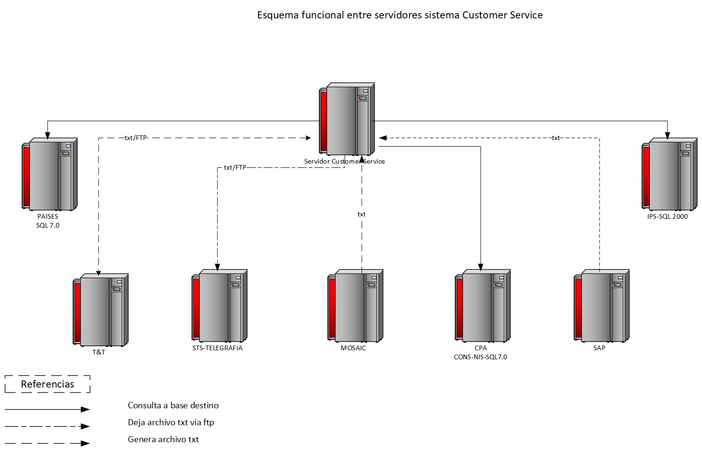
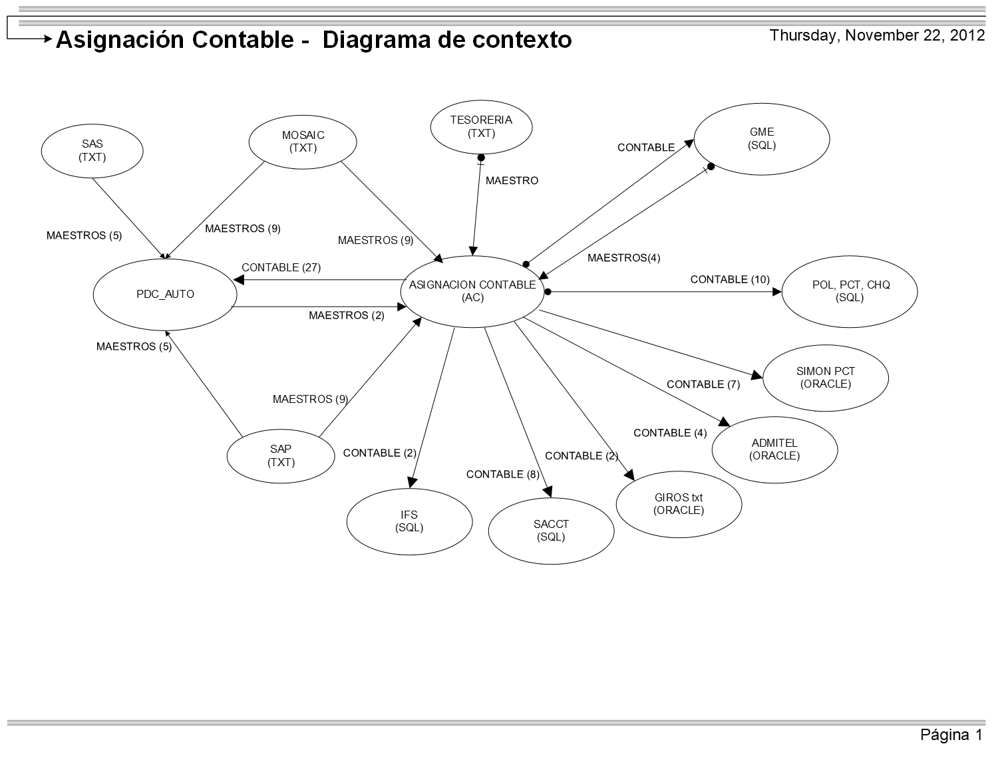

### 📊 Índice de Diagramas de Solución

Este repositorio centraliza la documentación técnica de los diversos proyectos de desarrollo de sistemas en los que he participado, ya sea como diseñador principal o colaborador clave.

| Archivo | Descripcion |
| :--- | :--- |
|  | Este diagrama representa el ecosistema de la Gestión de Beneficios por Tarjeta y cómo interactúan los diversos datastores y actores con el núcleo del sistema. |
|  | Este diagrama detalla cómo fluyen los datos desde la carga hasta su impacto en la base de datos para las pruebas en el Sistema de Escrutinio Provisorio. |
|  | Esquema funcional entre servidores para el sistema de Customer Service. |
|  | Este diagrama representa el ecosistema de **Asignacion Contable** y detalla tanto a quien provee la parametria contable como de quien obtiene informacion para generar dicha parametría. |
