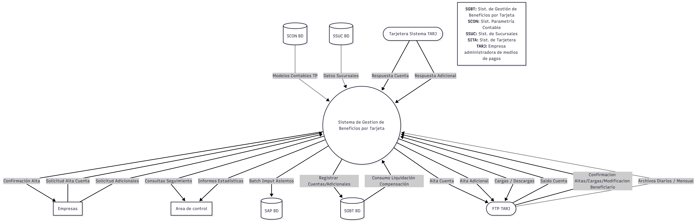
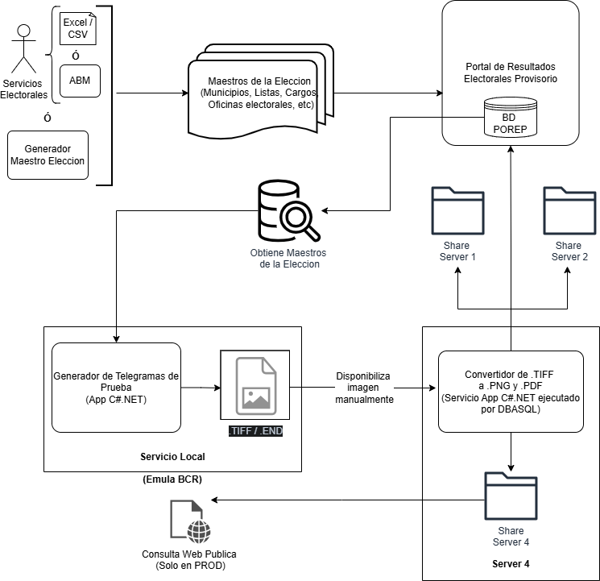
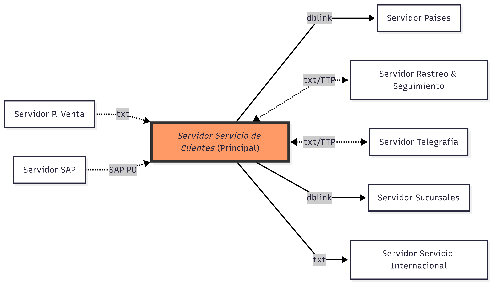
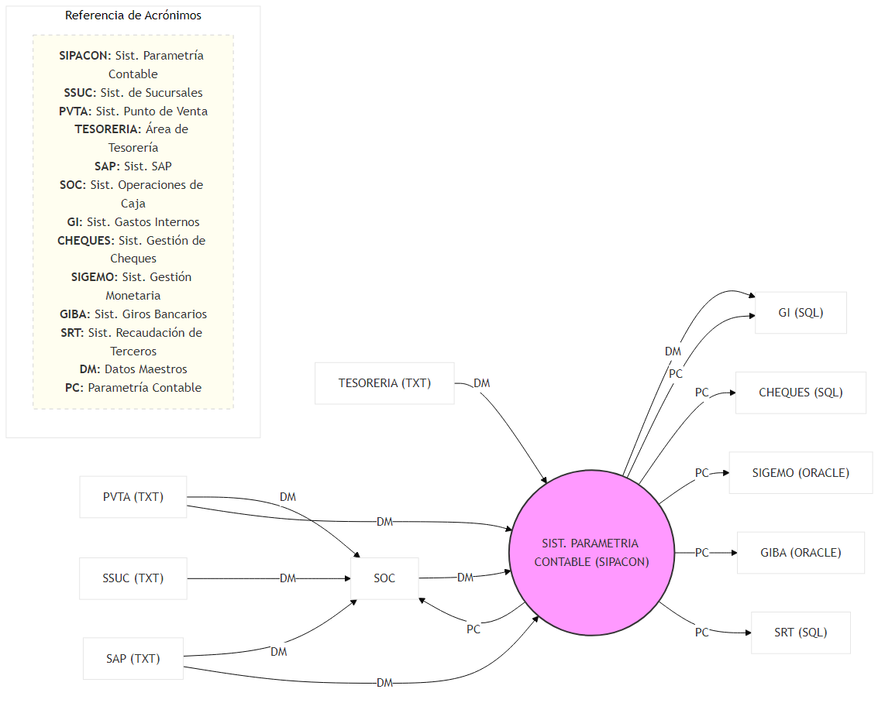
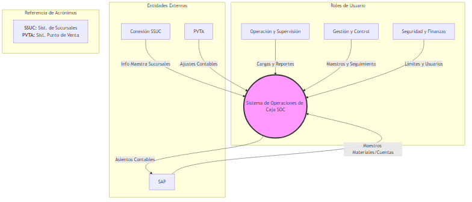
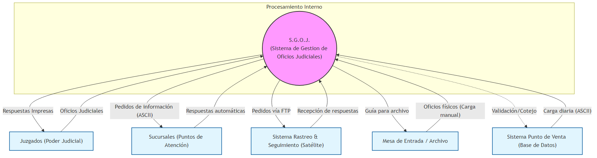
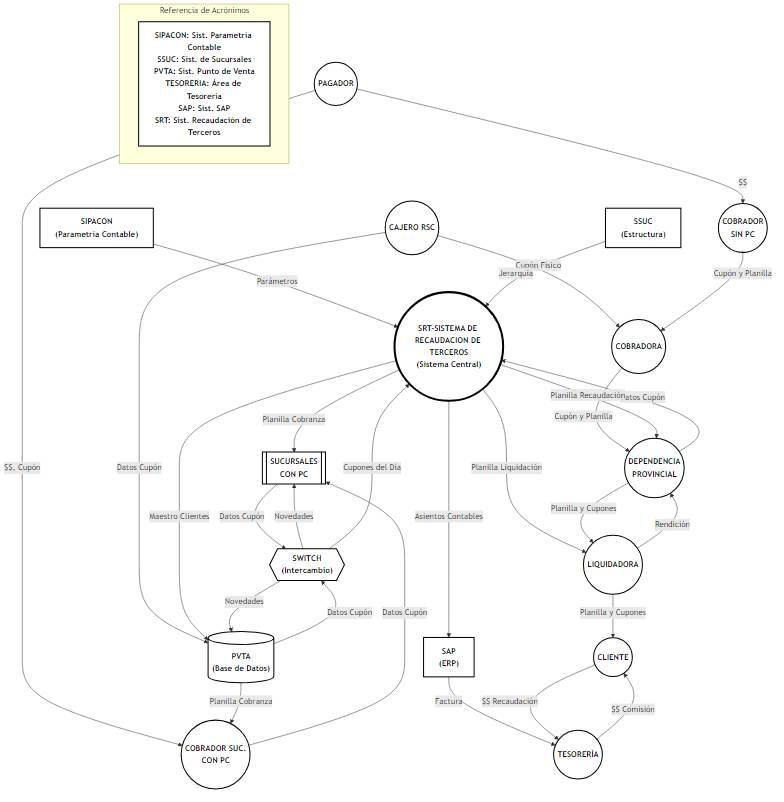
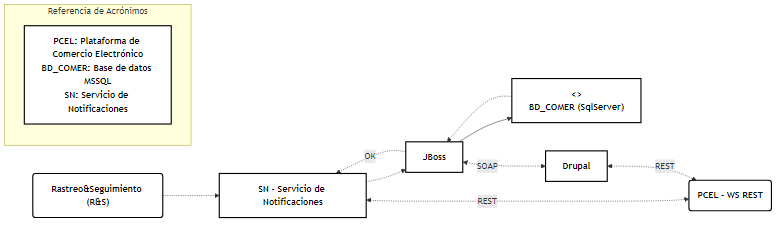
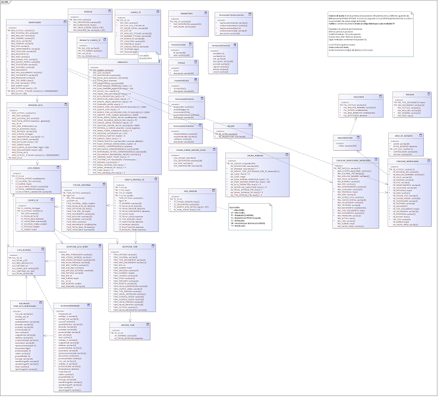

### 📊 Índice de Diagramas de Solución

Este repositorio centraliza la documentación técnica de los diversos proyectos de desarrollo de sistemas en los que he participado, ya sea como diseñador principal o colaborador clave.

| Archivo | Descripcion |
| :--- | :--- |
|  | **Sistema de Gestion de Beneficios por Tarjeta**   Diagrama que representa el ecosistema de la Gestión de Beneficios por Tarjeta y cómo interactúan los diversos datastores y actores con el núcleo del sistema. |
|  | **Portal de Resultados Electorales Provisorio**   Diagrama que detalla cómo fluyen los datos desde la carga hasta su impacto en la base de datos para las pruebas del Portal de Resultados Electorales Provisorio. |
|  | **Sistema de Servicio de Clientes**   Esquema funcional entre servidores para el Sistema de Servicio de Clientes. |
|  | **Sistema de Parametria Contable**   Diagrama representa y detalla tanto a quien provee la parametria contable como de quien obtiene informacion para generar dicha parametría. |
|  | **Sistema de Operaciones de Caja**    Diagrama de contexto que representa al Sistema de Operaciones de Caja (SOC) el cual efecuta la gestion operativa y financiera de las operaciones en sucursales. |
|  | **Sistema de Gestion de Oficios Judiciales**    Este diagrama de contexto representa al Sistema de Gestion de Oficios Judiciales (SGOJ) cuyo propósito principal es optimizar el control de la documentación legal recibida mediante la automatización de procesos y la reducción de errores manuales. |
|  | **Sistema de Recaudacion de Terceros**    Diagrama de contexto que representa al Sistema de Recaudacion de Terceros (SRT) el cual gestiona la recaudacion en sucursales por cuentas de clientes con los cuales se tiene un convenio . |
|  | **Arquitectura Solucion COMEREL**    Diagrama que detalla arquitectura de la solucion para realizar notificacion, seguimiento y control de envios hacia una plataforma de comercio electronico. |
|  | **Sistema de Gestion de Beneficios por Tarjeta**    (Privado) DER correspondiente a SGBT - Solicitar via [LinkedIn](https://www.linkedin.com/in/aldoshk/)|
|  | **Proceso BATCH**    Diagrama que detalla los flujos de información entre las diversas entidades involucradas para el procesamiento de las declaraciones juradas provenientes del formulario F572Web del organismo del estado ARCA
